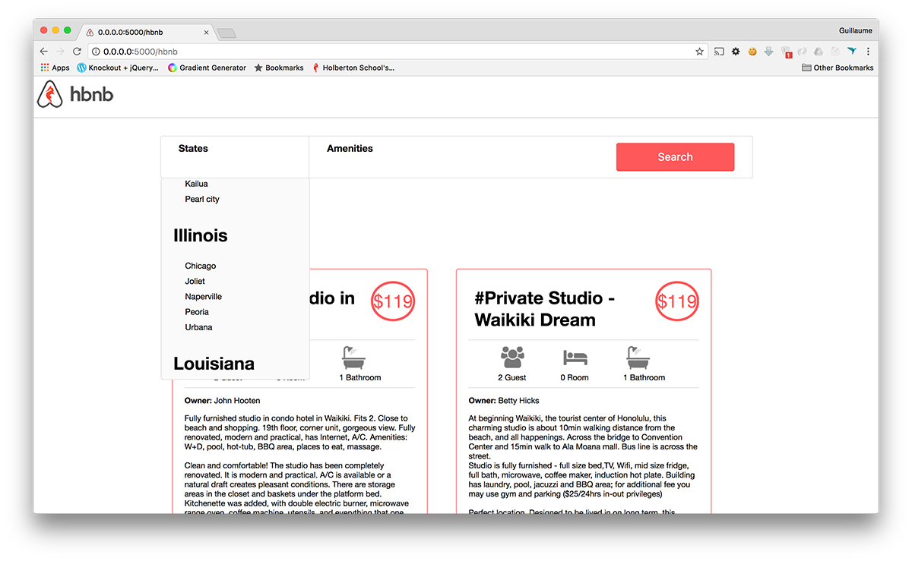

# AirBnB Clone V4

This is a complete full-stack web application, integrating a MySQL database and Flask RESTful API with a dynamic HTML5/CSS3/jQuery front-end.

It was based off the basic characteristics of the Airbnb platform.


# Iterations

The project was developed in several iterations, being V4 the last one. This iterations encompassed several concepts and integrations that will be explained below.

## The Console

The first iteration of the project consisted on building an interactive console in order to allow for development testing.


The Console was coded in order to work with a temporary storage engine based on JSON, and included the next features:

- Create a new object (ex: a new User or a new Place)
- Retrieve an object from a file, a database etc…
- Do operations on objects (count, compute stats, etc…)
- Update attributes of an object
- Destroy an object

The console has 2 modes.

**Interactive**

```
$ ./console.py
(hbnb) help

Documented commands (type help <topic>):
========================================
EOF  help  quit

(hbnb)
(hbnb)
(hbnb) quit
$
```

**Non Interactive**

```
$ echo "help" | ./console.py
(hbnb)

Documented commands (type help <topic>):
========================================
EOF  help  quit
(hbnb)
$
$ cat test_help
help
$
$ cat test_help | ./console.py
(hbnb)

Documented commands (type help <topic>):
========================================
EOF  help  quit
(hbnb)
$
```

## Web Static

This part of the project consisted in building the basic CSS and HTML source code.


## MySQL

This section consisted on the data modeling for the relational database in MySQL.


## Web Framework

This iteration consisted on building the first approach to dynamic content for the application by using Flask and Jinja, and effectively having Server Side Render.

For this development, the MySQL database started being used in order to serve content to the client, and provide it with back end based features.

All of the HTML and CSS source code started being hosted in the server, and no items were hard coded, but instead produced through dynamic data integration.




## RESTful API

Although the Server Side Render with Flask and Jinja was interesting, this section consisted on developing a different approach to dynamic content generation, starting with a RESTful API.

This Application Programming Interface was built with Flask and SQLAlchemy in order to work with MySQL and respond to HTTP requests.


The endpoints can be seen below.

    GET /api/v1/status
    **Returns the status of the API

    GET /api/v1/stats
    **Retrieves the number of each objects by type
    GET /api/v1/states
    **Retrieves the list of all State objects

    GET /api/v1/states/<state_id>
    **Retrieves a State object
    DELETE /api/v1/states/<state_id>
    **Deletes a State object
    POST /api/v1/states
    **Creates a State
    PUT /api/v1/states/<state_id>
    **Updates a State object

    GET /api/v1/states/<state_id>/cities
    **Retrieves the list of all City objects of a State
    GET /api/v1/cities/<city_id>
    **Retrieves a City object
    DELETE /api/v1/cities/<city_id>
    Deletes a City object
    POST /api/v1/states/<state_id>/cities
    Creates a City
    PUT /api/v1/cities/<city_id>
    Updates a City object

    GET /api/v1/amenities
    **Retrieves the list of all Amenity objects
    GET /api/v1/amenities/<amenity_id>
    **Retrieves a Amenity object
    DELETE /api/v1/amenities/<amenity_id>
    **Deletes a `menity object
    POST /api/v1/amenities
    **Creates a Amenity
    PUT /api/v1/amenities/<amenity_id>
    **Updates a Amenity object

    GET /api/v1/users
    **Retrieves the list of all User objects
    GET /api/v1/users/<user_id>
    **Retrieves a User object
    DELETE /api/v1/users/<user_id>
    **Deletes a User object
    POST /api/v1/users
    **Creates a User
    PUT /api/v1/users/<user_id>
    **Updates a User object

    GET /api/v1/cities/<city_id>/places
    **Retrieves the list of all Place objects of a City
    GET /api/v1/places/<place_id>
    **Retrieves a Place object
    DELETE /api/v1/places/<place_id>
    **Deletes a Place object
    POST /api/v1/cities/<city_id>/places
    **Creates a Place
    PUT /api/v1/places/<place_id>
    **Updates a Place object

    GET /api/v1/places/<place_id>/reviews
    **Retrieves the list of all Review objects of a Place
    GET /api/v1/reviews/<review_id>
    **Retrieves a Review object
    DELETE /api/v1/reviews/<review_id>
    **Deletes a Review object
    POST /api/v1/places/<place_id>/reviews
    **Creates a Review
    PUT /api/v1/reviews/<review_id>
    **Updates a Review object

    GET /api/v1/places/<place_id>/amenities
    **Retrieves the list of all Amenity objects of a Place
    DELETE /api/v1/places/<place_id>/amenities/<amenity_id>
    **Deletes a Amenity` object to a Place
    POST /api/v1/places/<place_id>/amenities/<amenity_id>
    **Link a Amenity object to a Place

    POST /api/v1/places_search
    **Retrieves all Place objects depending of the JSON in the body of the request.

    GET /apidocs
    **Gets the documentation of the API built in Flasgger

## Web Dynamic

This was the final iteration of the project and consisted in changing the Server Side Render for Client Based Render using JavaScript with jQuery, and the RESTful API from before.


# Challenges and Future Features

This was a big project that helped in understanding how a Fullstack application works. Some of the most challenging parts had to do with the Object Relational Mapping for the API, and the Client Based Render.

For future projects, this serves as a great base for beginning to understand other technologies such as React, NodeJS, and Mongo, among others.

# About Myself

🎯 I am a Fullstack developer in love with technology and keen to learn new things everyday. My strenghts reside in Python and JavaScript although I am not afraid to take on any other language.

🎯 I have experience developing both back end and front end. I have used technologies such as Bootstrap, SASS, React, Flask, Django, Express, SQL, MongoDB, AWS, among others.

🎯 I also studied Sound Engineering some years ago, and I love music, videogames, and audiovisual media.

🔹 [LinkedIn](https://www.linkedin.com/in/jhoan-stiven-zamora-caicedo/)

🔹 [Twitter](https://twitter.com/JhoanZamora10)
